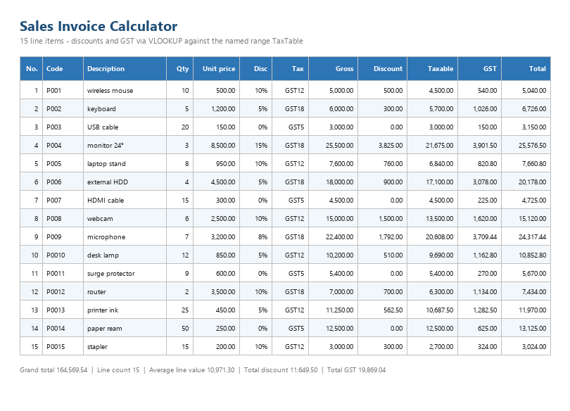

# Sales Invoice Calculator

**Practice exercise** — Excel



## Purpose

Calculate line amounts, discounts and tax for a sales invoice, using a VLOOKUP lookup table for tax rates.

## Structure

| Sheet | Contents |
|---|---|
| `Invoice` | 15 line items (rows 2–16) and a summary block (K17:L22) |
| `Lists` | Tax-code lookup table and the product-code list |
| `README` | Documentation tab |

## Calculations

| Item | Formula |
|---|---|
| Gross Amount | Quantity × Unit Price |
| Discount Amount | Gross Amount × Discount % |
| Taxable Amount | Gross Amount − Discount Amount |
| GST Amount | Taxable Amount × VLOOKUP(Tax Code, TaxTable) |
| Invoice Total | Taxable Amount + GST Amount |

The GST column uses:

```excel
=IFERROR(J2*VLOOKUP(G2,TaxTable,2,FALSE),"Check tax code")
```

`TaxTable` is a **named range** (`Lists!$A$2:$B$4`) so the lookup survives rows being inserted or moved — no absolute `$N$2:$O$4` to maintain.

## Tax table

| Code | Rate |
|---|---|
| GST5 | 5% |
| GST12 | 12% |
| GST18 | 18% |

## Results

| Metric | Value |
|---|---:|
| Grand total | 164,569.54 |
| Average invoice line value | 10,971.30 |
| Line count | 15 |
| Total discount | 11,649.50 |
| Total taxable | 144,700.50 |
| Total GST | 19,869.04 |

## Data quality

| Column | Validation |
|---|---|
| Tax Code | List → `TaxCodes` |
| Product Code | List → `ProductCodes` |
| Quantity | Whole number > 0 |
| Unit Price | Decimal ≥ 0 |
| Discount % | Decimal between 0 and 1 |

Lookups are wrapped in `IFERROR`, so an unmatched tax code shows *"Check tax code"* instead of `#N/A`.

## Protection

Only the input cells (**A2:G16**) are unlocked. Every calculated column and the summary block are locked, so formulas cannot be overwritten by accident. Formatting remains allowed.

## Skills demonstrated

`VLOOKUP` against a named lookup table · `IFERROR` · Data Validation lists · Worksheet protection with unlocked inputs · Layered calculations · Percentage and currency formatting
